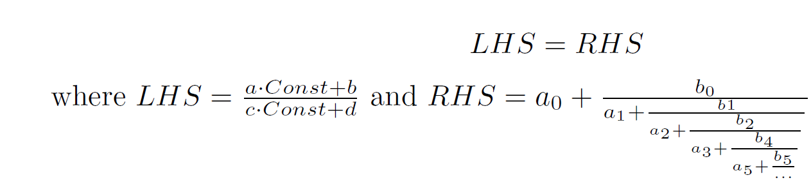

# MasseyRamanujan

The Ramanujan Machine is an algorithmic approach to discover new mathematical conjectures. For the time being, the project is focused in number theory, specifically on finding formulas relating fundamental constants like pi, e, and the Riemann zeta function values to various continued fractions.

For more information, please go to [RamanujanMachine.com](https://www.RamanujanMachine.com).

## Installation

Clone the repo and install the requirements in the source/requirements.txt file. If you have pip, it can be done by running
```
pip install -r requirements.txt
```
under the source/ folder. That's it, you are now ready to discover new conjectures.

## Running the code

The source code exists in the source/ folder and should be run from there. Results that are generated in the examples below will be printed on the screen as well as to a LaTeX and a PDF under the source/results/ folder for your convenience.

### Cool examples

#### e
To find a few formulas for e, run (don't forget to be under the source/ folder when you run it)
```python
python main.py enumerate_over_gcf -lhs_constant e -num_of_cores 1 -lhs_search_limit 5 -poly_a_order 2 -poly_a_coefficient_max 5 -poly_b_order 2 -poly_b_coefficient_max 5
```

#### pi
To find a few formulas for pi, run (don't forget to be under the source/ folder when you run it)
```python
python main.py enumerate_over_gcf -lhs_constant pi -num_of_cores 1 -lhs_search_limit 20 -poly_a_order 2 -poly_a_coefficient_max 13 -poly_b_order 3 -poly_b_coefficient_max 11 -custom_generator_bn polynomial_shift1
```

#### Riemann Zeta function at 3 (Aépry's constant)
To find a few formulas related to the Riemann zeta function at 3 (Zeta of 3 is called [Apéry's constant](https://www.wikiwand.com/en/Ap%C3%A9ry%27s_constant) and has a role in the electron's gyromagnetic ratio), run:
```python
python main.py enumerate_over_gcf -lhs_constant zeta -function_value 3 -num_of_cores 2 -lhs_search_limit 14 -poly_a_order 3 -poly_a_coefficient_max 20 -poly_b_order 3 -poly_b_coefficient_max 20 -custom_generator_an zeta3_an -custom_generator_bn zeta_bn
```

#### Catalan constant
To find a few formulas related to the [catalan constant](https://www.wikiwand.com/en/Catalan%27s_constant), you can run the following code. This one takes a bit longer generate the hash table for and make take a few minutes.
```python
python main.py enumerate_over_gcf -lhs_constant catalan pi-acosh_2 -num_of_cores 1 -lhs_search_limit 8 -poly_a_order 3 -poly_a_coefficient_max 15 -poly_b_order 2 -poly_b_coefficient_max 5 -custom_generator_bn catalan_bn
```

Now that you've seen how to run the basic code, you can tweak the search parameters and find new conjectures of your own. To do so, please read the next section.

### Tweaking the search parameters

Under the source/ folder,
```python
python main.py
```
runs the code. The infrastructure supports various algorithms for discovery of constants and for now can only be run using the enumerate_over_gcf toggle.

##### enumerate_over_gcf module: 
this is our new MITM implementation. The program will "mine" new Continued Fraction conjectures of the type:

The code let's you control the equation space scanned by the algorithm. To get more information about what you can control and tweak, run
```python
python main.py enumerate_over_gcf -h
```

Parameters that you can currently control without changing the code itself include:

* -lhs_constant {zeta,e,pi,catalan,golden_ratio,khinchin,euler-mascheroni,pi-acosh_2} [{zeta,e,pi,catalan,golden_ratio,khinchin,euler-mascheroni,pi-acosh_2} ...] constants to search for - initializing the left-hand-side hash table
* -function_value FUNCTION_VALUE Which value of the function are we assessing (assuming LHS constant takes an arguments)
* -lhs_search_limit LHS_SEARCH_LIMIT The limit for the LHS coefficients
* -num_of_cores NUM_OF_CORES The number of cores to run on
* -poly_a_order POLY_A_ORDER the number of free coefficients for {a_n} series
* -poly_a_coefficient_max POLY_A_COEFFICIENT_MAX The maximum value for the coefficients of the {a_n} polynomial
* -poly_b_order POLY_B_ORDER the number of free coefficients for {b_n} series
* -poly_b_coefficient_max POLY_B_COEFFICIENT_MAX The maximum value for the coefficients of the {b_n} polynomial
* -custom_generator_an CUSTOM_GENERATOR_AN (optional) custom generator for {a_n} series. if defined, poly_a_order is ignored
* -custom_generator_bn CUSTOM_GENERATOR_BN (optional) custom generator for {a_n} series. if defined, poly_b_order is ignored

more detailed information regarding this module can be found in documentation/enumerate_over_gcf.pdf